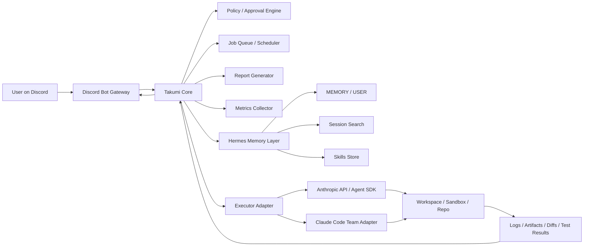
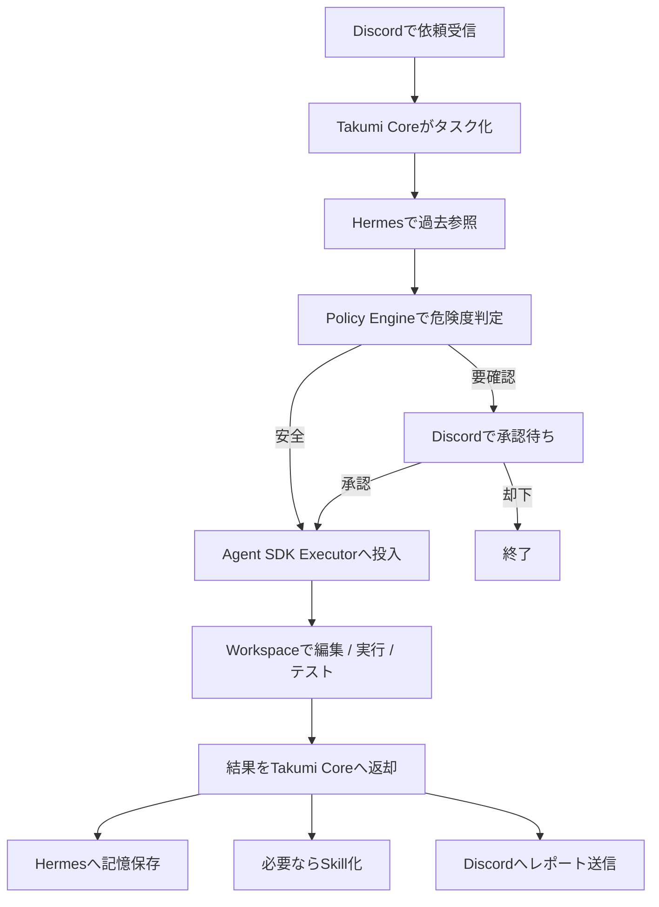
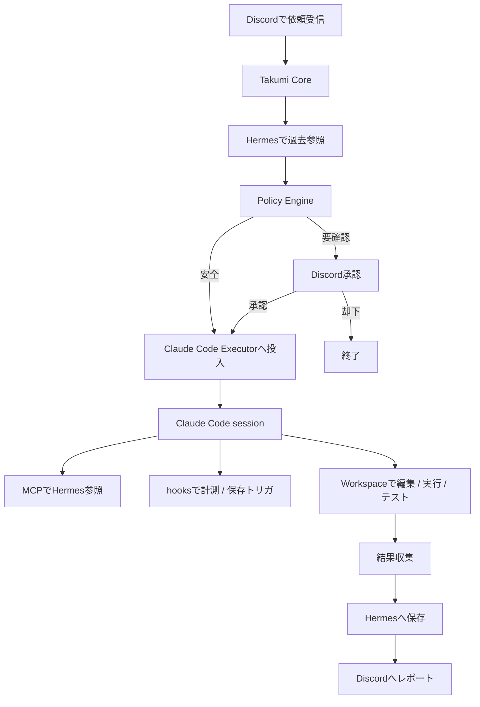

# Takumi Autonomy on VPS

## API先行・Claude Code Team移行可能なPoCアーキテクチャ設計

## 1. 目的

このPoCの目的は、VPS上で常駐する半自律型AIエージェント基盤を作り、次のループを安定運用できるようにすること。

**Observe → Compare → Think → Act → Report → Save → Repeat**

このPoCでは、最初は **Claude API / Agent SDK** を使って私用環境で立ち上げる。

ただし設計は、後から **Claude Code Team** に移行しても中核構造を変えずに済むようにする。

---

## 2. 設計方針

### 2.1 結論

このPoCでは、Claude をシステムの中心にしない。

中心に置くのは **Takumi Core** であり、Claude は **交換可能な実行エンジン** として扱う。

つまり役割は次のように固定する。

- **Takumi Core**
    
    ジョブ管理、承認管理、停止条件、ログ、評価指標の司令塔
    
- **Hermes**
    
    記憶、過去参照、スキル保存の正本
    
- **Claude Executor**
    
    実行担当
    
    - PoCでは `Anthropic API / Agent SDK`
    - 将来は `Claude Code Team`
- **Discord**
    
    人間との実務インターフェース
    
- **VPS**
    
    常駐・保存・スケジュール実行基盤
    

### 2.2 この分離を採る理由

この設計にすると、将来 Team へ移行するときに差し替えるのは **Executor 層だけ** で済む。

Claude Code 側には hooks、`CLAUDE.md`、plugins、MCP など共有しやすい仕組みがあるので、共通ルールや拡張点は repo 側に寄せておくのが移行に強い。([Claude](https://code.claude.com/docs/en/hooks-guide))

---

## 3. 全体アーキテクチャ



---

## 4. レイヤー設計

## 4.1 Takumi Core

Takumi Core は全体の司令塔であり、Claude 依存にしない。

### 担当

- タスク受付
- 優先度判定
- 危険操作の承認フロー
- リトライ上限管理
- タイムアウト管理
- 停止条件
- 実行レポート生成
- 評価指標の集計

### ポイント

- 「考えるモデル」と「運用の意思決定」を分離する
- 無限ループ防止を Core 側の責務にする
- 危険操作の判定を executor 任せにしない

---

## 4.2 Hermes Memory Layer

Hermes は **唯一の長期記憶の正本** にする。

Claude 側の memory は補助であり、正本にしない。

### 担当

- 永続記憶
- 過去セッション検索
- 成功パターンの skill 化
- session 単位の学びの蓄積

### ポイント

- **MEMORY / USER** は核だけ
- 詳細手順は **skills**
- 過去探索は **session_search**
- ログが増えても、検索できる形で残す

この切り方は、Hermes を外部認知基盤として使い、Recall と Save を外部化する方針と一致する。添付レポートでも、Hermes 側を「真の核記憶」とし、Claude 側は補助に留める方向が推奨されている。

---

## 4.3 Executor Adapter

Executor Adapter は、Takumi Core から見た「共通の実行インターフェース」。

### 役割

- プロンプト投入
- ツール実行
- コマンド実行
- コード編集
- テスト
- 結果収集

### 実装候補

- `agent_sdk_executor`
- `claude_code_executor`

### 共通インターフェース例

```tsx
interface Executor {
  plan(task: TaskContext): Promise<ExecutionPlan>
  run(task: TaskContext): Promise<ExecutionResult>
  resume(sessionId: string, input: string): Promise<ExecutionResult>
  stop(sessionId: string): Promise<void>
}
```

### 重要

このインターフェースにより、API 版で作った上位ロジックをそのまま Team 側へ流用できる。

---

## 5. API先行PoCの実行フロー



---

## 6. 将来のClaude Code Team移行フロー



Claude Code 側では hooks で context 注入、監査、通知、保護ファイルのブロック、再注入などを自動化できる。`CLAUDE.md` は毎セッション読み込まれ、project スコープでは source control で共有できる。plugin は skill / agent / hook をまとめて共有できる。これが Team 移行しやすい理由になる。([Claude](https://code.claude.com/docs/en/hooks-guide))

---

## 7. PoCで固定するもの / 将来差し替えるもの

## 7.1 固定するもの

以下は API 版でも Team 版でも共通。

- Discord bot
- task schema
- approval policy
- danger operation classifier
- Hermes memory schema
- session search API
- skill 保存ルール
- report format
- metrics format
- workspace 構成
- job state machine

## 7.2 差し替えるもの

以下だけ差し替える。

- Claude 実行経路
- 認証方法
- 実行時フックの張り方
- Claude 固有の共有パッケージ方法

---

## 8. 共有境界の考え方

## 8.1 Claude依存にしてよいもの

- 実行時の推論
- コード編集
- テスト実行
- 一時的な session context
- Claude Code hooks
- Claude Code plugin packaging

## 8.2 Claude依存にしてはいけないもの

- 長期記憶の正本
- 承認状態
- 危険操作ルール
- ジョブ履歴
- 再試行回数
- 停止条件
- 成果物メタデータ
- 評価指標

---

## 9. ディレクトリ設計

```
takumi-autonomy/
├─ README.md
├─ docs/
│  ├─ architecture.md
│  ├─ operating-principles.md
│  ├─ approval-policy.md
│  ├─ memory-policy.md
│  ├─ skill-policy.md
│  ├─ metrics.md
│  └─ migration-to-claude-code-team.md
│
├─ .env.example
├─ docker-compose.yml
├─ Makefile
├─ pyproject.toml
│
├─ apps/
│  ├─ discord-bot/
│  │  ├─ main.py
│  │  ├─ commands/
│  │  ├─ handlers/
│  │  └─ views/
│  │
│  ├─ takumi-core/
│  │  ├─ main.py
│  │  ├─ orchestration/
│  │  │  ├─ task_router.py
│  │  │  ├─ job_runner.py
│  │  │  ├─ retry_manager.py
│  │  │  └─ stop_conditions.py
│  │  ├─ policy/
│  │  │  ├─ approval_policy.py
│  │  │  ├─ danger_classifier.py
│  │  │  └─ permission_matrix.py
│  │  ├─ reporting/
│  │  │  ├─ report_builder.py
│  │  │  └─ discord_reporter.py
│  │  ├─ metrics/
│  │  │  ├─ mor.py
│  │  │  ├─ prr.py
│  │  │  ├─ pcr.py
│  │  │  └─ runtime_metrics.py
│  │  └─ state/
│  │     ├─ job_store.py
│  │     ├─ approval_store.py
│  │     └─ execution_log.py
│  │
│  ├─ hermes-bridge/
│  │  ├─ main.py
│  │  ├─ memory_api.py
│  │  ├─ session_search_api.py
│  │  ├─ skill_api.py
│  │  └─ adapters/
│  │     └─ hermes_local.py
│  │
│  └─ executor-gateway/
│     ├─ main.py
│     ├─ base.py
│     ├─ agent_sdk_executor.py
│     ├─ claude_code_executor.py
│     └─ workspace_manager.py
│
├─ packages/
│  ├─ schemas/
│  │  ├─ task.py
│  │  ├─ execution_result.py
│  │  ├─ approval_request.py
│  │  └─ report_schema.py
│  │
│  ├─ prompts/
│  │  ├─ system/
│  │  │  ├─ takumi_core.md
│  │  │  ├─ safety_rules.md
│  │  │  └─ recall_rules.md
│  │  ├─ task/
│  │  └─ report/
│  │
│  ├─ skills/
│  │  ├─ templates/
│  │  └─ exported/
│  │
│  └─ utils/
│     ├─ logging.py
│     ├─ time.py
│     └─ ids.py
│
├─ runtime/
│  ├─ workspaces/
│  │  ├─ jobs/
│  │  └─ sandboxes/
│  ├─ logs/
│  │  ├─ app/
│  │  ├─ jobs/
│  │  └─ audits/
│  ├─ reports/
│  └─ tmp/
│
├─ integrations/
│  ├─ discord/
│  ├─ anthropic/
│  ├─ claude-code/
│  └─ hermes/
│
├─ .claude/
│  ├─ CLAUDE.md
│  ├─ settings.json
│  ├─ hooks/
│  └─ plugins/
│
└─ tests/
   ├─ unit/
   ├─ integration/
   └─ e2e/
```

---

## 10. ディレクトリごとの意味

## `apps/takumi-core/`

司令塔。

このプロジェクトの中で最も重要。

Claude を差し替えても、ここは変えない前提で作る。

## `apps/hermes-bridge/`

Hermes を API / MCP 的に外出しする層。

最低限、次の3つを持つ。

- `session_search`
- `memory_write`
- `skill_create`

これは添付レポートの推奨と同じ。

## `apps/executor-gateway/`

Claude 実行アダプタ層。

ここが API 版と Team 版の切替点。

## `.claude/`

将来 Claude Code Team に寄せるための共有資産置き場。

ここには project 共有可能な `CLAUDE.md`、settings、hooks、plugin 関連を置く。`CLAUDE.md` は project 共有指示として source control に乗せられる。([Claude](https://code.claude.com/docs/en/memory))

---

## 11. Claude Code Team移行を見据えた `.claude/` 設計

## 11.1 `./.claude/CLAUDE.md`

用途:

- プロジェクト共通ルール
- 危険操作の基本方針
- Hermes 利用ルール
- 過去参照の作法

例:

```markdown
# Takumi Claude Code Rules

## Core Principles
- Do not guess when unsure.
- Prefer recall before re-deciding.
- Save reusable learnings after completion.
- Ask for approval before destructive or external-impact operations.

## Recall Rules
- If a task may depend on prior decisions, use Hermes session search first.
- Treat Hermes as the source of truth for persistent memory.

## Save Rules
- Save only durable learnings.
- Convert repeatable successful procedures into skills.
- Do not save secrets, tokens, or raw credentials.

## Safety Rules
- Never delete important files without approval.
- Never change production or external services without approval.
- Never write irreversible changes without an approval event.
```

`CLAUDE.md` は「毎回説明し直す内容」を置く場所で、多段手順や局所的ルールは skill や path-scoped rule へ寄せるのが公式推奨。([Claude](https://code.claude.com/docs/en/memory))

## 11.2 `.claude/settings.json`

ここでは Team 移行時に効く設定を管理する。

想定用途:

- hooks
- permissions
- MCP server 定義
- path rule
- local 除外

## 11.3 `.claude/plugins/`

正式に plugin 化するときの置き場。

plugin は skills / agents / hooks をまとめて共有でき、複数 project で使い回しやすい。共有したい機能が増えてきたら `.claude/` の素置きから plugin へ昇格させるのが自然。([Claude](https://code.claude.com/docs/en/plugins))

---

## 12. Hermes Bridge の最小インターフェース

```tsx
interface HermesBridge {
  sessionSearch(query: string, scope?: SearchScope): Promise<SearchResult>
  memoryWrite(input: MemoryEntry): Promise<WriteResult>
  skillCreate(input: SkillDraft): Promise<SkillResult>
  skillUpdate(input: SkillDraft): Promise<SkillResult>
}
```

### 返却イメージ

```json
{
  "hits": [
    {
      "session_id": "sess_123",
      "timestamp": "2026-04-13T10:00:00Z",
      "summary": "以前このrepoでは migration 前に dry-run を必須にしていた"
    }
  ],
  "summary": "過去には本番影響のある migration は必ず dry-run と approval を経由していた"
}
```

---

## 13. Approval Engine の設計

## 13.1 原則

承認は Claude 側ではなく Takumi Core 側で判定する。

## 13.2 判定レベル

### Auto Allow

- 読み取り
- ローカル編集
- lint
- unit test
- diff確認
- 安全なログ収集
- 過去参照
- 記憶保存
- skill保存

### Approval Required

- 重要ファイル削除
- 権限変更
- 永続設定変更
- 外部サービス書き込み
- 機密送信
- 本番環境操作
- force push
- secret操作
- 広範囲処理

### Deny by Default

- ルール外の危険操作
- policyで未分類の高リスク実行
- 停止条件に抵触した再試行

---

## 14. Workspace設計

Claude Code のセキュリティ資料では、書き込みは開始ディレクトリ配下に制限され、機密性の高い操作には承認が必要で、ネットワーク系操作も標準では承認対象になる。非対話の `-p` では trust verification の挙動も変わるため、PoC でも workspace 分離は最初から入れておくべきです。([Claude](https://code.claude.com/docs/en/security))

### ルール

- 1ジョブ1ワークスペース
- 元repo直編集を避ける
- worktree または sandbox を使う
- 成果物と監査ログを残す
- 失敗ジョブは隔離して残す

### 例

```
runtime/workspaces/jobs/job-20260413-001/
├─ repo/
├─ artifacts/
├─ logs/
└─ result.json
```

---

## 15. 評価指標

添付レポートに沿って、PoC の評価指標はこの3つを中核にする。

## 15.1 MOR

**Memory Operation Rate**

- `memory_write` 呼び出し率
- 有効保存率
- 重複拒否率

## 15.2 PRR

**Past Reference Rate**

- `session_search` 呼び出し率
- 過去依存タスクでの参照率

## 15.3 PCR

**Proceduralization Rate**

- task 完了後の skill 化率
- 保存済み skill の再利用率

---

## 16. 実装フェーズ

## Phase 1

最小常駐PoC

- Discord bot
- Takumi Core
- Hermes Bridge
- Agent SDK executor
- approval flow
- basic logging

## Phase 2

半自律化

- retry上限
- stop conditions
- report整備
- metrics収集

## Phase 3

記憶定着

- session_search強化
- memory save基準
- save/no-save分類
- recall first運用

## Phase 4

手続き化

- skill draft生成
- skill reviewフロー
- 再利用検知
- exported skills 管理

## Phase 5

Claude Code Team移行準備

- `.claude/CLAUDE.md` 整備
- hooks 整備
- MCP 接続
- plugin 化
- `claude_code_executor` 実装

---

## 17. いま作るべき最小スコープ

最初のPoCでは、全部作らない。

### 最小で作るもの

- Discord → Core → Agent SDK → Workspace の一連
- Hermes の `session_search`
- Hermes の `memory_write`
- 危険操作の承認待ち
- ジョブレポート
- MOR / PRR / PCR のログ

### まだ作らないもの

- 完全自動 cron 自律運用
- 複数 executor 同時運用
- 本番環境の自動操作
- 複雑な plugin 配布
- 高度な multi-agent 化

---

## 18. 一言まとめ

このPoCの本質は、

**Claude で賢くすることではなく、毎回ゼロから始めない構造を作ること**

にある。

そのために、

- **Takumi Core** を司令塔にする
- **Hermes** を記憶の正本にする
- **Claude** を交換可能な実行エンジンにする
- **Discord** を承認と報告の窓口にする
- **VPS** を常駐と保存の土台にする

という構成を採る。

これにより、今は API で進め、後から Claude Code Team に寄せても、

ゴールを見失わずに段階的に強化できる。